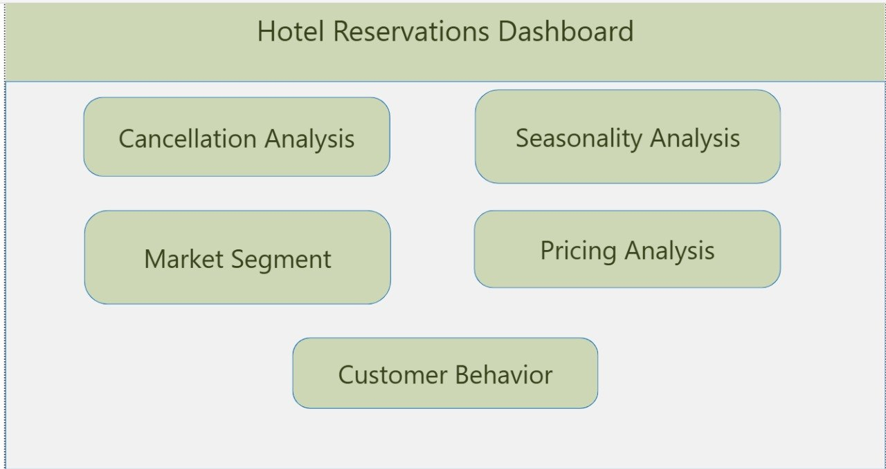
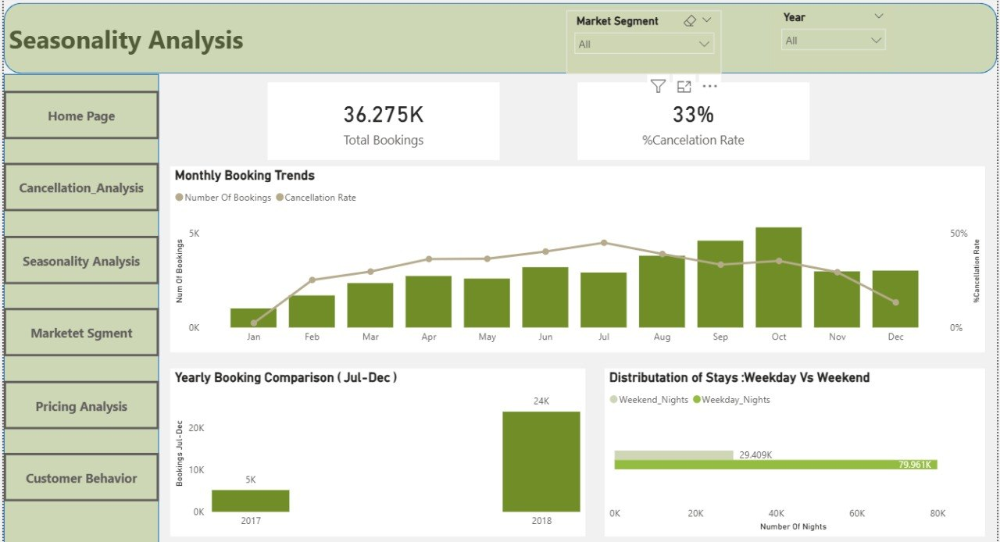
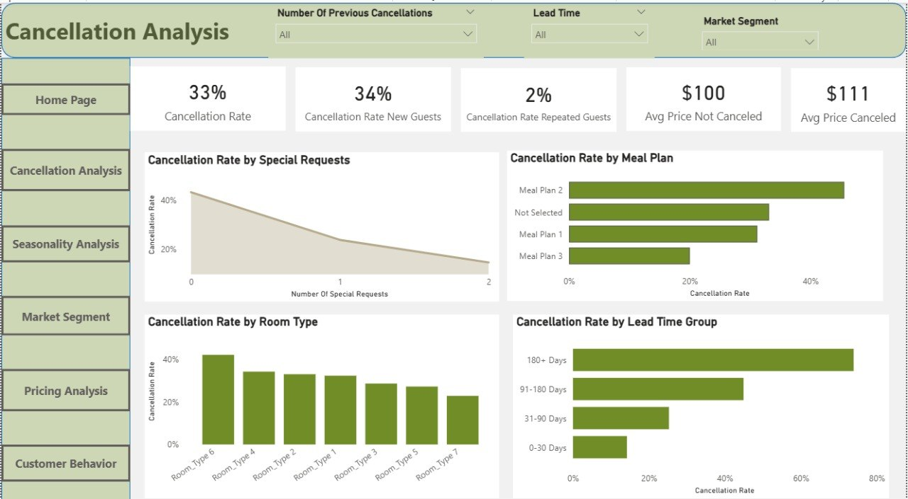
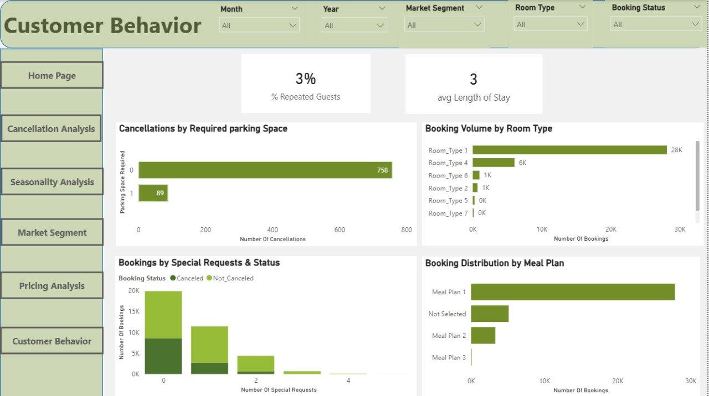
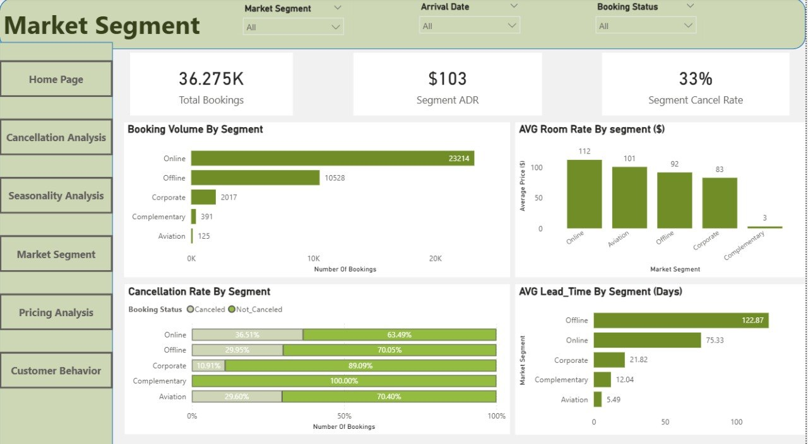
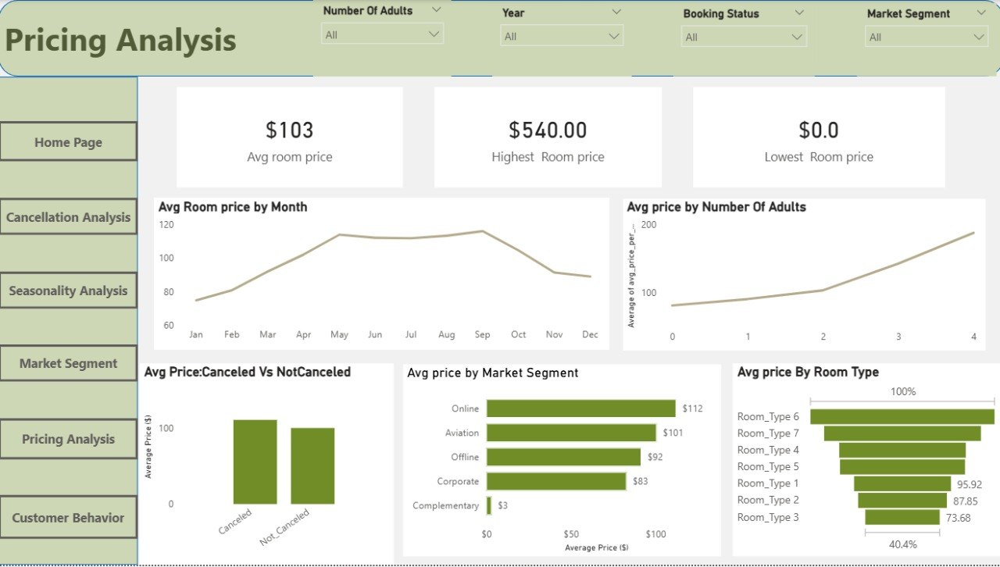

# 🏨 Hotel Reservations Dashboard

A multi-page Power BI dashboard analyzing hotel booking data across **36,275 reservations** (2017–2018), covering seasonality, pricing, market segments, customer behavior, and cancellation patterns.

---

## 📊 Dashboard Pages

| Page | Key Question |
|------|-------------|
| 🏠 Home | Overview & Navigation |
| 📅 Seasonality Analysis | When do bookings peak? |
| 💰 Pricing Analysis | How does pricing vary? |
| 🏷️ Market Segment | Which segments drive revenue? |
| 👤 Customer Behavior | How do customers behave? |
| ❌ Cancellation Analysis | Why do customers cancel? |

---

## 🔍 Key Insights

1. **Peak Season is October** — highest booking volume with relatively low cancellation rate
2. **Early bookings = higher cancellation risk** — bookings made 180+ days in advance have a **73.9% cancellation rate**
3. **Special requests predict commitment** — guests with 0 special requests cancel at 43%, while guests with 3+ requests cancel at 0%
4. **Online channel dominates** — 63.99% of all bookings with the highest avg price ($112)
5. **Complementary bookings cancel 100%** — these are non-revenue bookings (staff/VIP)
6. **Canceled bookings are priced higher** — avg $111 vs $102 for completed bookings

---

## 🗂️ Data Model (Star Schema)

```
                    Dim_Date
                       |
Dim_Meal ── Fact_Reservations ── Dim_Room
                       |
              Dim_Segment    Dim_status
```

**Fact Table:** `Fact_Reservations` — 36,275 rows, 18 columns

**Dimension Tables:**
- `Dim_Date` — Date, Month, Quarter, Year
- `Dim_Meal` — Meal plan types
- `Dim_Room` — Room types
- `Dim_Segment` — Market segment types
- `Dim_status` — Booking status (Canceled / Not_Canceled)

---

## 📐 DAX Measures

```dax
-- Cancellation Rate
Cancellation Rate =
DIVIDE(
    CALCULATE(COUNTROWS('Fact_Reservations'),
    FILTER('Fact_Reservations', RELATED('Dim_status'[booking_status]) = "Canceled")),
    COUNTROWS('Fact_Reservations')
)

-- Avg Price Canceled
Avg Price Canceled =
CALCULATE(
    AVERAGE('Fact_Reservations'[avg_price_per_room]),
    FILTER('Fact_Reservations',
        RELATED('Dim_status'[booking_status]) = "Canceled" &&
        'Fact_Reservations'[avg_price_per_room] > 0)
)

-- Lowest Room Price (excluding free/complementary)
Lowest Room Price =
MINX(
    FILTER('Fact_Reservations',
        'Fact_Reservations'[avg_price_per_room] > 0 &&
        RELATED('Dim_Segment'[market_segment_type]) <> "Complementary"),
    'Fact_Reservations'[avg_price_per_room]
)

-- Bookings Jul-Dec (fair yearly comparison)
Bookings Jul-Dec =
CALCULATE(
    COUNT('Fact_Reservations'[Booking_ID]),
    'Fact_Reservations'[arrival_month] >= 7
)
```

---

## 🛠️ Tools Used

- **Power BI Desktop** — Data modeling & visualization
- **Power Query** — Data cleaning & transformation
- **DAX** — Calculated measures & columns

---

## 📁 Dataset

- **Source:** [Hotel Reservations Dataset](https://www.kaggle.com/datasets/ahsan81/hotel-reservations-classification-dataset) — Kaggle
- **Records:** 36,275 bookings
- **Period:** July 2017 – December 2018
- **Features:** 19 columns including booking details, pricing, and guest information

---

## 📸 Dashboard Preview

### Home Page


### Seasonality Analysis


### Cancellation Analysis


### Customer Behavior


### Market Segment


### Pricing Analysis

---

---

> *"Data is the new oil — but only if you can refine it."*
